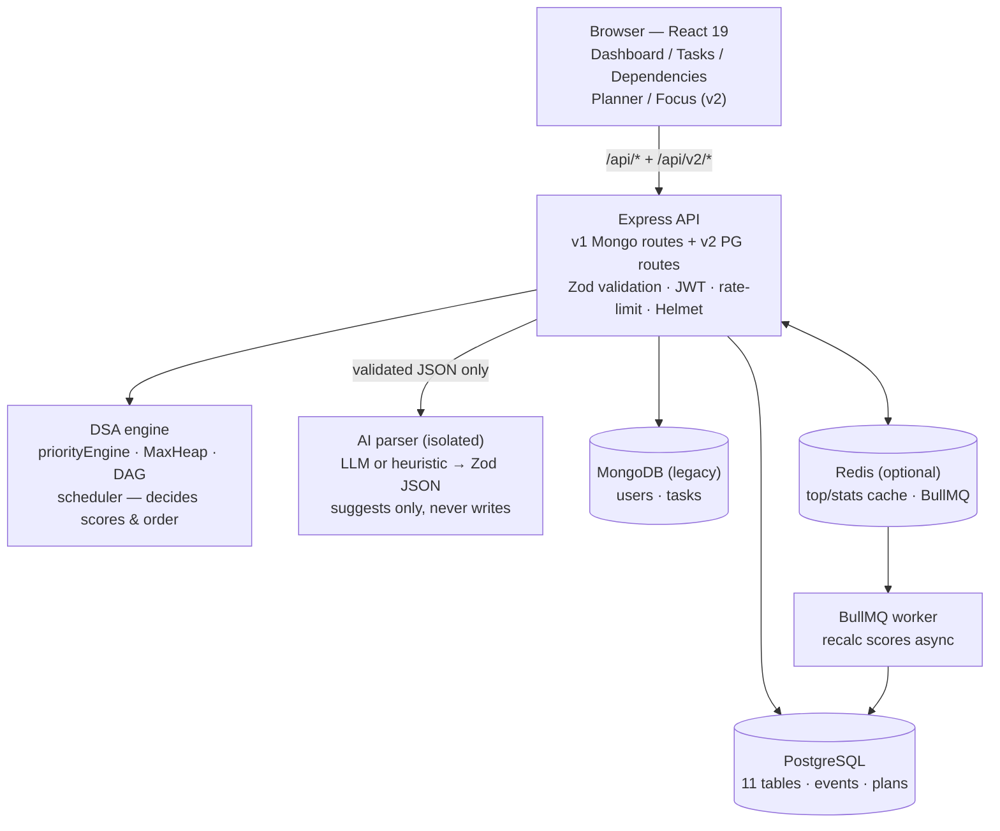
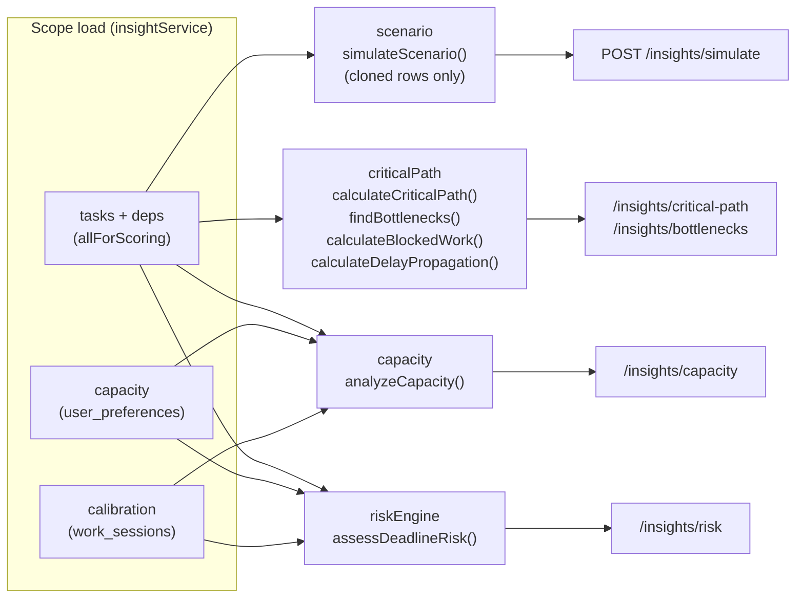
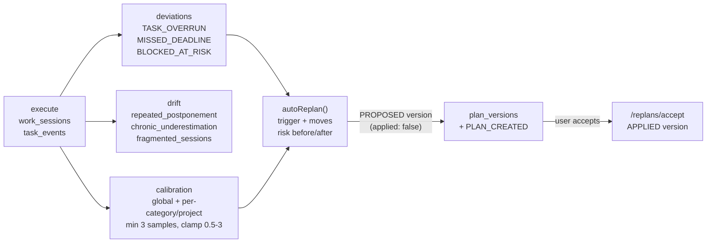

# Architecture

## System map



## Layering (server)

```
routes/        ── thin: auth guard → Zod validate → controller
controllers/   ── thin: shape HTTP in/out, map service results to status codes
services/      ── orchestration + transactions + events (pgTaskService, plannerService, replanService)
repositories/  ── raw SQL only (pgUsers, pgTasks, pgSessions)
dsa-engine/    ── pure deterministic algorithms, no I/O
ai/ planner/   ── understanding (LLM/heuristic) + computed health
cache/ jobs/   ── Redis + BullMQ, both optional with inline fallback
db/            ── pgClient (pooled, instrumented), schema.sql, verify, migration
```

Controllers never touch SQL; repositories never touch the engine; the engine
never touches I/O. Mutations write a `task_events` row in the same transaction.

## Request flows

**Brain dump → plan** (`docs/API.md § planner`):
parse (read-only, AI→Zod→clarifications) → user reviews/edits → confirm
(transactional create → DAG cycle check → deterministic scores → greedy schedule
→ computed health → `plan_versions` snapshot). Priority/schedule/health are
engine outputs; the AI output contains no scores by schema design.

**What's next** (`GET /tasks/next`): top-20 engine candidates → drop blocked
(reported, never recommended) → drop over-budget → energy bonus → rank →
pick + alternates with `why[]`. Acceptance/override recorded with reason enums.

**Missed work** (`/replans/*`): detect overdue → greedy day-packing proposal
(read-only, per-day impact) → user accepts/edits → `TASK_RESCHEDULED` events +
plan snapshot. Nothing moves silently.

## DSA engine (identity, kept)

| Structure | Use | Complexity |
|---|---|---|
| Weighted scorer | `urgency×.30 + importance×.25 + deadline×.25 + ease×.20`, ×20, −20 if blocked | O(1) |
| MaxHeap | Top-N retrieval | insert/extract O(log n) |
| DAG | Deps, DFS cycle guard, Kahn topo sort, unlock-impact BFS | O(V+E) |
| Greedy scheduler | Heap order over engine scores | O(V log V + E) |

Known history: `topologicalSort` shipped with inverted in-degrees (dropped
nodes); fixed and covered in `tests/dag.test.js`. The scheduler previously
claimed topo ordering it didn't enforce — now honest: heap order over
dependency-penalized scores.

## Planning intelligence (Phase 1)

Pure deterministic engines in `server/planner/`, orchestrated read-only by
`services/insightService.js`, exposed at `/api/v2/insights/*`. No new tables:
everything computes from tasks, dependencies, work sessions, and preferences.



**Risk model** (`riskEngine.js`, documented in-code): load points 0-55 from
remaining/capacity ratio with kink points at 0.7x and 1.0x, +0-10 blocked
share, +3 per overdue task (cap 12), +0-8 downstream concentration, floor
MEDIUM on any overdue item, cap MEDIUM with no in-scope deadline. Levels:
<30 LOW, <55 MEDIUM, <75 HIGH, else CRITICAL. The summary sentence is
generated from the top factors - never templated optimism.

**Critical path**: longest estimated-minutes chain over open tasks via DP on
the existing DAG's topological order (cycle edges are rejected by `addEdge`,
so hostile input degrades to a shorter path, never a hang).

**Calibration**: global actual/estimated factor from timed sessions on
completed work, clamped [0.5, 3], minimum 3 samples before it engages.
Feeds risk, capacity, and critical path durations.

**Explanation object**: engine breakdown mapped to signed factors plus
honestly-marked non-score context (downstream unlocks). Additive on the
existing `/explain` response - old fields untouched.

**Simulation**: synthetic deadline moves, removals, capacity overrides, and
day shifts applied to cloned rows; reports current vs scenario risk,
affected set (traversed on the ORIGINAL graph so removals don't hide stranded
dependents), freed minutes, bottleneck shift, and a mitigation drawn from the
scenario's capacity options. Proven read-only by test (row re-read equality).

## Adaptive loop (Phase 2)

Detection proposes; only explicit acceptance applies. No new tables - versions
are `plan_versions` rows (proposal state in `health_details`), history is
`task_events`, learning reads `work_sessions`.



- **Deviation thresholds** (in-code, conservative): overrun = actual ≥150% of
  estimate with ≥15 min excess; postponement = 3+ reschedules; fragmentation =
  4+ sittings on still-open work; underestimation = category factor ≥1.3.
- **Auto-replan** picks the top deviation as trigger, builds day-packed moves
  with the existing proposer, prices risk before/after through the same risk
  + simulation engines, and persists trigger, reasons, moves, and both risk
  readings. Nothing moves until `/replans/accept`, which writes its own
  version - the audit trail shows proposed vs applied.
- **Drift** reports observed patterns with evidence strings and one concrete
  planning adjustment each. No psychological claims, ever.

## Product experience (Phase 4 - UI over existing APIs, no new endpoints)

- **Planner**: auditable plan history (version, proposed/applied state,
  trigger, reason, risk before/after, moves) reloading after each confirm;
  read-only what-if panel (move/drop/capacity scenarios with affected set,
  bottleneck shift, mitigation).
- **Dependencies**: critical-path chain + bottleneck explanation banner;
  dashed-ring critical nodes and red-ring bottleneck node with tag on the SVG
  graph, with a legend for the overlays.
- **Task cards**: blocked chip computed locally from populated dependency
  statuses; one explain call per card expansion renders the signed factor
  bars and the generated summary sentence.
- **Focus**: Skip promotes the first alternate (recorded as prefer-first);
  Snooze pushes the deadline 24h and re-ranks; day-plan section orders the
  selected window into energy periods; deviations card proposes recovery
  plans that the replan banner applies.
- **Profile**: planning-rhythm editor (capacity + energy map) feeding
  scheduling/risk/day-plan; follow-through card from recommendation
  adherence (hidden until data exists).

## Advanced planning (Phase 3)

- **Context switching** (`planner/contextSwitch.js`): 0-7 cost per transition
  (category +2, distinct projects +3, energy distance +0-2). `scheduleWithContext`
  runs Kahn's algorithm over the DAG picking `priorityScore - lambda x cost`
  among ready tasks - dependencies always beat grouping; cycles drain by
  priority instead of hanging.
- **Energy-aware day plan** (`planner/dayPlan.js`): the work window
  (user `work_start`/`work_end`, default 09:00-18:00) split into
  morning/afternoon/evening thirds carrying the user's chosen energy levels
  (`PUT /preferences`). Tasks land where energy matches exactly first,
  nearest otherwise; overflow is listed as unscheduled, never overfilled.
  A user-controlled preference, not a diagnosis.
- **Scope creep** (`planner/scope.js`): original vs current counts, added
  tasks, `TASK_DELETED` removals and `TASK_RESCHEDULED` moves from the event
  trail, growth %, against a goal baseline or the whole workload.
- **Commitments**: nullable-by-design columns (`commitment_type`,
  `stakeholder`, both defaulted) accepted on create/update, surfaced in
  `presentTask`, with an at-risk listing (overdue / blocked / due < 48h) for
  non-personal types at `/insights/commitments`.
- **Migration discipline**: `db/migrations/*.sql` (idempotent ALTERs +
  constraint guards) applied by `db/migrate.js` with a `schema_migrations`
  ledger; `schema.sql` updated in lockstep so fresh installs converge.
  Verified by running twice (second run is a no-op).

## AI / determinism split (mandatory)

```
User → Brain dump → AI Parser → {goals, tasks, constraints} (Zod-validated)
                                        ↓
              Dependency engine → Priority engine → Scheduler → Plan + health
```

The model may not emit scores, ranks, schedules, SQL, or commands; user text is
data (prompt-injection clause in `ai/plannerPrompt.js`). Failures are typed
502s with a heuristic fallback path — never silent degradation.

## Cache & jobs

- Cache-aside on `GET top` (60s) / `stats` (120s), `X-Cache: HIT/MISS`,
  synchronous bust on every writer. Miss/down → Postgres directly.
- `POST /tasks/recalc` enqueues score recalculation (deadline pressure drifts);
  without Redis the same handler runs inline — response states which.
- Rate limiting is in-memory fixed-window on auth (per-process; Redis sliding
  window is the documented scale-up).

## Observability

Pino JSON logs (secret redaction), per-route latency/error counters, PG latency
(slow >200ms logged with SQL prefix), cache hit/miss, job outcomes, AI calls —
all at `GET /api/metrics` (unauthenticated by scraper convention; firewall it
in prod).

## Observed performance (measured, not claimed)

| Measurement | Value | Context |
|---|---|---|
| PG round-trip | ~250ms | Neon from dev sandbox (`priosync_db_latency_ms_sum`) |
| Register latency | ~1.5s | bcrypt-12 dominates (honestly flagged `slow`) |
| Unit suite | ~3s | 25 tests, no network |
| PG integration | ~50s | 4 flows, latency-bound |
| `vite build` | ~13s | 2453 modules |
| Images | api 292MB, web 97MB | `npm ci --omit=dev`, nginx static |

No invented benchmarks; re-measure with `EXPLAIN ANALYZE` + `/api/metrics`
before optimizing.

## Tradeoffs

| Decision | Why | Cost |
|---|---|---|
| Raw `pg` over Prisma | CTE/window control, no codegen churn mid-migration | Hand-written SQL, no generated types |
| v1+v2 coexist, no flag | Zero regression, explicit contract (§46) | Legacy routes idle (SPA is v2-only, single session) until decommission |
| Heuristic parser default | Works with no key/cost/latency | Dumber than LLM; LLM upgrades without contract change |
| In-memory rate limit | Zero infra, stops casual abuse | Per-process; needs Redis when scaled out |
| No `productivity_metrics` table | CTEs suffice until proven slow | Recompute per read (cached 120s) |
| Hand-rolled `/metrics` | Zero deps for what we measure | Adopt `prom-client` if histograms/alerts outgrow it |

## Roadmap

1. Migration cutover where Atlas is reachable (script + runbook exist)
2. ~~Unified auth~~ — done: SPA uses one v2 session (`V2SessionGate` retired);
   next is decommissioning legacy routes once migration parity is signed off
3. Time-aware scheduling (clock-time slots in `plan_items`)
4. Redis sliding-window limits, reminder jobs, planner-AI background path
5. Component tests once UI logic outgrows fetch wrappers
