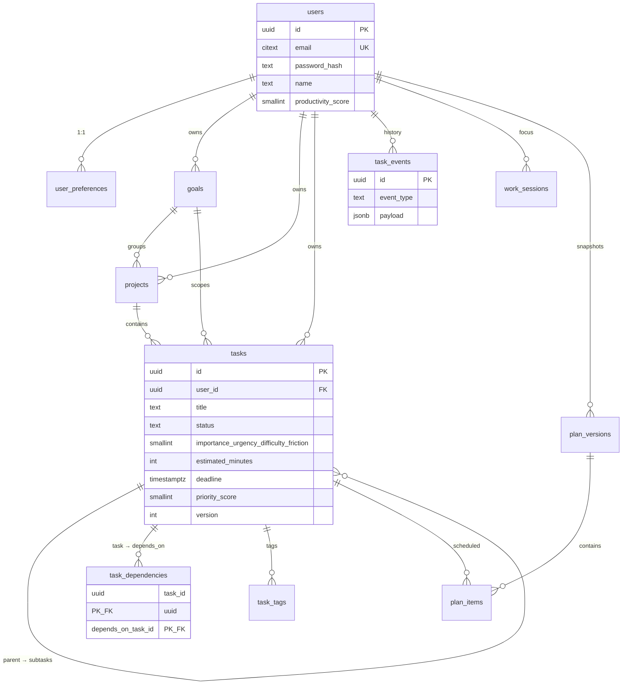

# Database

## Legacy: MongoDB (v1, stable)

Two collections via Mongoose (`server/models/`):

- `users`: `_id, name, email(unique), password(bcrypt-12, select:false)`,
  `avatar, productivityScore, tasksCreated, tasksCompleted`,
  `focusSessions[{task, startedAt, endedAt, durationSeconds, completed}]` (capped 200 in code), timestamps.
- `tasks`: `_id, owner(→users, indexed), title(≤150), description(≤2000), deadline(required)`,
  `importance/urgency/difficulty 1–5, status enum, dependencies[ObjectId→tasks]`,
  `priorityScore 0–100, priorityTier, category, completedAt`, timestamps.
  Indexes: `{owner,priorityScore}`, `{owner,status}`, `{owner,deadline}`.

Relationships are by convention (no FK enforcement); dependencies are an
embedded array. Kept running; new development targets Postgres.

## Target: PostgreSQL (v2)

Full DDL: `server/db/schema.sql`. Conventions: UUID PKs
(`gen_random_uuid()`), `TIMESTAMPTZ`, FKs with deliberate `ON DELETE`
(`CASCADE` for ownership, `SET NULL` for history survival), `CHECK`s,
partial/composite indexes on hot paths only.



Key tables:

- `tasks` — adds `friction`, `estimated_minutes` (default 30), `energy_fit`,
  `scheduled_start/end`, `parent_task_id` (subtasks, no extra table),
  `version` (optimistic concurrency → `409`), `project_id`, `goal_id`.
- `task_dependencies` — relational DAG edges; composite PK kills duplicates;
  `task_id <> depends_on_task_id` CHECK; cycle rejection stays in the app
  (DFS), where the graph already lives.
- `task_events` — append-only (`TASK_CREATED/UPDATED/COMPLETED/RESCHEDULED`,
  `DEPENDENCY_ADDED`, `PLAN_CREATED/UPDATED/OVERRIDDEN`,
  `RECOMMENDATION_ACCEPTED/OVERRIDDEN`, `FOCUS_*`). `task_id SET NULL` so
  history survives deletion. Powers analytics, adherence, decision log.
- `work_sessions` — normalized focus sessions (was an embedded array).
- `plan_versions` + `plan_items` — versioned schedules with computed health
  (`health_details = {checks, warnings}`, never LLM output).
- `user_preferences` — planner constraints (`available_minutes_per_day`, …).
- Deliberately absent: `productivity_metrics` (serve from CTEs until
  `EXPLAIN ANALYZE` proves otherwise).

Hot indexes and why:

```sql
CREATE INDEX ix_tasks_user_priority ON tasks(user_id, priority_score DESC)
  WHERE status IN ('pending','in-progress');   -- GET /top feed
CREATE INDEX ix_tasks_user_status ON tasks(user_id, status);          -- lists
CREATE INDEX ix_active_task_deadlines ON tasks(deadline)
  WHERE status <> 'completed';                  -- overdue scan
CREATE INDEX ix_events_user_time ON task_events(user_id, created_at DESC);
```

## Neon operations notes (learned the hard way)

- **Scale-to-zero wake stalls.** Free-tier computes suspend after ~5 min idle.
  First contact can stall many seconds while the compute wakes; the server
  handles this: boot retries with backoff, a failed probe never leaves a
  half-ready pool (routes 503 fast), and mid-run connectivity errors map to
  `503 Database is warming up…` — a client retry moments later succeeds
  because `pg-pool` discards dead clients on next checkout. If you see
  repeated `Postgres unavailable; retrying with backoff` lines, check the
  Neon dashboard (project active? region outage?) rather than the app.
- **IPv4-first DNS.** Neon hostnames return AAAA first; the server forces
  `ipv4first` resolution (`db/pgClient.js`, same class of fix as mongoose
  `family: 4`) because IPv4-only hosts otherwise wander before fallback.
- **Pooled endpoint.** Use the `-pooler` hostname (already the case in
  `.env.example`) — it absorbs wake churn and connection fan-out better than
  the direct endpoint for a pooled app server.

## Planning intelligence storage (Phase 1: none new)
The risk/critical-path/bottleneck/capacity/simulation engines are stateless:
they read `tasks`, `task_dependencies`, `work_sessions`, and
`user_preferences`, and return computed views. No snapshots, no new tables.
If read load ever justifies it, the honest next step is a
`planning_risk_snapshots` table fed by the BullMQ recalc worker - not ad-hoc
caching. Plan versions and the decision-relevant events (`TASK_RESCHEDULED`,
`PLAN_UPDATED`, `RECOMMENDATION_*`) already persist in `plan_versions` /
`task_events`, which is what the v1-v2 plan history UI reads.

## Phase 3 columns (migration 001)

Two nullable-by-design column sets, both `NOT NULL ... DEFAULT` so existing
rows are unaffected, enforced by CHECKs added under guards:

- `user_preferences`: `energy_morning` (default high), `energy_afternoon`
  (normal), `energy_evening` (low) - the user's daily rhythm.
- `tasks`: `commitment_type` (default personal: personal/team/client/
  academic/deadline), `stakeholder` (default '').

Applied with `node db/migrate.js` (ledger in `schema_migrations`,
re-runnable). `schema.sql` carries the same columns for fresh installs.

## Migration runbook (Mongo → Postgres)

Script: `server/db/migrate-mongo-to-postgres.js` — idempotent
(`mongo_id` upserts), per-user transactions, orphan/self-edge tolerant.

```bash
mongodump --uri="$MONGO_URI" --out=backup/          # 1. backup, never skipped
node server/db/verify.js --apply                     # 2. schema on target
node server/db/migrate-mongo-to-postgres.js --dry-run  # 3. counts only
node server/db/migrate-mongo-to-postgres.js --apply    # 4. write
# 5. parity: script prints mongo vs pg user/task/completed/dep counts — must match
# 6. keep Mongo read-only until frontend parity; decommission only after sign-off
```

Mapping: `User._id→users(id+mongo_id)`, `password→password_hash` (hashes carry
over, so credentials keep working), `focusSessions[]→work_sessions`,
`Task._id→tasks(id+mongo_id)`, `dependencies[]→task_dependencies`,
one bootstrapped `TASK_CREATED` per task. New columns take documented defaults
(`estimated_minutes=30, friction=3, version=1`).

> Status: script exists and is tested for idempotency logic, but a full
> production cutover still needs Atlas reachability from the migration host
> (sandbox DNS blocks `mongodb+srv`). Do not run against production Postgres
> without a backup and a throwaway-branch rehearsal.
